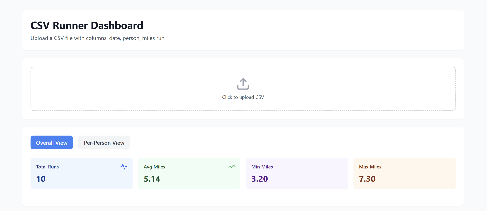
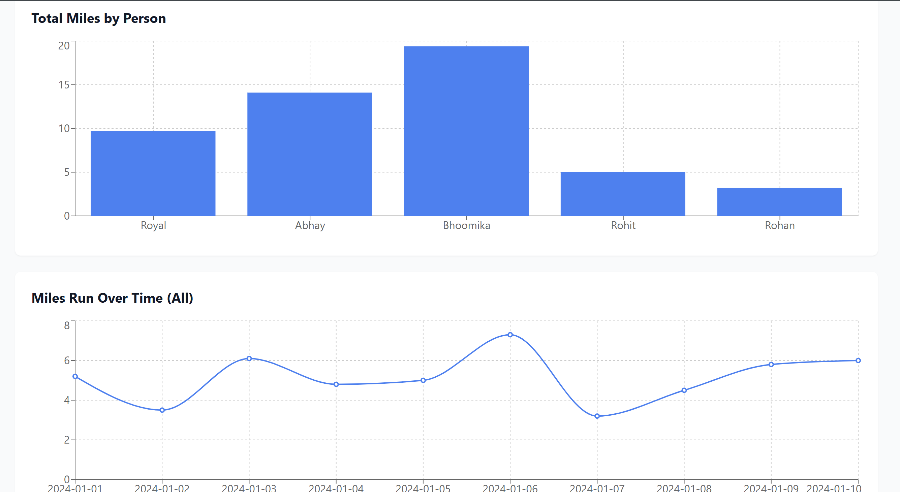

# CSV Runner Dashboard

<!-- Replace the src values with your actual image paths -->
<p align="center">
  
</p>

<p align="center">
  
  
</p>

## Project Overview
Challenge: CSV Runner Dashboard
Built: A Next.js dashboard that parses CSV files with running data and displays visualizations and metrics for overall and per-person views.

## Assumptions
- CSV columns are case-insensitive but must be named exactly: date, person, miles run
- Dates are treated as strings for display
- Negative miles values are invalid
- Empty rows are rejected
- All miles values must be valid numbers

## Prerequisites
- Node.js 18.17 or later
- npm or yarn

## Setup

### Install
```bash
npm install
```

### Environment
No environment variables required. The .env.example file is included but empty.

### No Seeding Required
This app works entirely with uploaded CSV files.

## Run & Verify

### Start Development Server
```bash
npm run dev
```

Open http://localhost:3000

### Test Steps
1. Upload the provided sample.csv file
2. Verify overall view shows:
   - Total runs count
   - Average, min, max miles metrics
   - Bar chart showing total miles by person
   - Line chart showing all runs over time
3. Click "Per-Person View" button
4. Select a person from dropdown
5. Verify per-person view shows:
   - Individual metrics for selected person
   - Line chart of that person's runs over time
6. Test error handling:
   - Upload a file with wrong headers (should show error)
   - Upload a file with invalid miles values (should show error)
   - Upload a file with missing data (should show error)

## Features & Limitations

### Working Features
- CSV upload and parsing
- Header validation (date, person, miles run required)
- Data type validation (miles must be valid numbers)
- Overall view with aggregate metrics
- Per-person view with individual metrics
- Bar chart for total miles by person
- Line chart for miles over time
- Error messages for invalid CSV files

### Known Limitations
- Dates are not parsed into Date objects
- No data persistence
- No CSV export functionality
- Charts may overlap with many data points

### Future Improvements
- Date range filtering
- Data editing capability
- Multiple CSV comparison
- Export to PDF/Excel
- Dark mode support

## Architecture

### Folder Structure
```
csv-runner-dashboard/
├── app/
│   ├── layout.js      (root layout)
│   ├── page.js        (home page, renders Dashboard)
│   └── globals.css    (Tailwind imports)
├── components/
│   └── Dashboard.js   (main component)
└── sample.csv         (test data)
```

### Key Components
- Dashboard.js: Main component handling state, CSV parsing, and rendering

### State Management
Uses React useState hooks for:
- data: Parsed CSV records
- error: Error messages from validation
- view: Current view mode (overall/person)
- selectedPerson: Currently selected person in per-person view

### Data Flow
1. User uploads CSV file
2. FileReader reads file as text
3. parseCSV validates and transforms data
4. State updated with parsed data or error
5. Metrics calculated from state
6. Charts rendered with calculated data

## Accessibility & UI

### Accessibility
- Semantic HTML elements
- Focus visible on interactive elements
- Labels for form inputs
- ARIA attributes where needed
- Keyboard navigation support

### UI Design
- Consistent spacing using Tailwind utility classes
- Clear visual hierarchy with font sizes and weights
- Color-coded metric cards for quick scanning
- Responsive grid layout
- Hover states on interactive elements
- Error states with clear messaging

### Typography
- Headings: font-bold with appropriate sizes
- Body text: base size with normal weight
- Metrics: Large bold numbers for emphasis

### Color Contrast
All text meets WCAG AA standards:
- Dark text on light backgrounds
- Colored backgrounds use appropriate text colors
